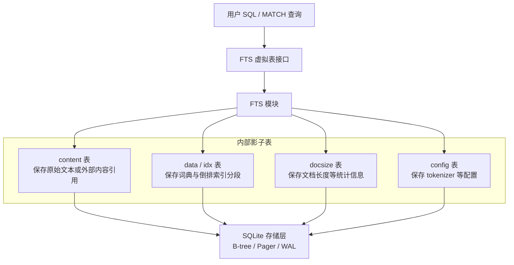
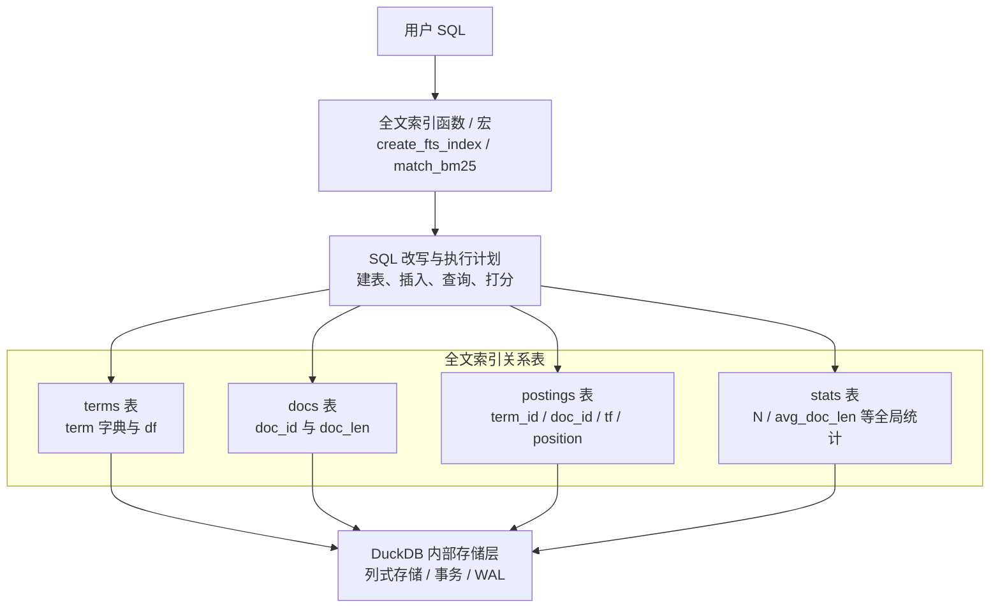
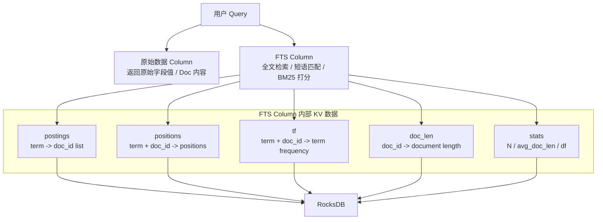

# 全文索引方案调研

## Sqlite

### 总体架构

SQLite 的全文索引以虚拟表（Virtual Table）的形式向上层暴露接口。用户在 SQL 层看到的是一张可查询、可写入的普通表，但实际的索引维护由 FTS 模块在内部完成。

创建一张 FTS 虚拟表时，SQLite 会同步创建一组内部影子表（Shadow Tables）。这些表用于保存原始文本、倒排索引、文档长度、配置项等信息。换句话说，虚拟表负责提供统一的访问入口，影子表负责承载真实的索引数据。

在存储层，这些影子表和 SQLite 的普通表一样，最终都基于 B-tree 组织和持久化。FTS 模块不会绕过 SQLite 的存储引擎单独管理文件，而是复用 SQLite 已有的表存储、事务、日志和恢复能力。

整体架构如下：



### 创建 FTS5 表

```sql
CREATE VIRTUAL TABLE ft USING fts5(title, body);

创建虚表 ft
创建 shadow tables:
  ft_data
  ft_idx
  ft_content
  ft_docsize
  ft_config
初始化 FTS5 配置
```

这里的 ft 是入口，真正数据在 shadow tables。

### 插入原始数据

```sql
INSERT INTO ft(rowid, title, body)
VALUES(1, 'SQLite intro', 'SQLite supports full text search');

调用 FTS5 xUpdate
保存原文到 ft_content
对 title/body 分词
生成 term -> rowid 的倒排信息
写入 ft_data
维护 ft_idx
写入 ft_docsize
更新 ft_config/统计信息
```

### 查询全文索引

```sql
SELECT rowid, title FROM ft WHERE ft MATCH 'sqlite';

SQLite planner 调用 FTS5 xBestIndex
FTS5 告诉 planner: 我可以处理 MATCH
执行时调用 FTS5 xFilter
FTS5 解析 MATCH 表达式
从 ft_idx / ft_data 查倒排索引
得到匹配 rowid
如果需要 title/body，再从 ft_content 取原文
```

### 查询并排序 BM25

```sql
SELECT rowid, title, bm25(ft) FROM ft WHERE ft MATCH 'sqlite' ORDER BY bm25(ft);

先走 MATCH 查倒排索引
对每个匹配 rowid 计算 BM25
BM25 使用词频、文档长度、全局统计等信息
相关数据来自 ft_data / ft_docsize / ft_config
按分数排序返回
```

### 删除原始数据

```sql
DELETE FROM ft WHERE rowid = 1;

调用 FTS5 xUpdate
读取/定位旧 rowid
从 ft_content 删除原文
从倒排索引中删除对应 term -> rowid 关系
更新 ft_docsize
```

FTS5 的底层 segment 结构可能不会立刻物理清干净，而是通过后续 merge/optimize 整理。

### 对已有字段建全文索引

```sql
假设已有表：
CREATE TABLE articles(
  id INTEGER PRIMARY KEY,
  title TEXT,
  body TEXT,
  category TEXT
);

创建虚拟表：
CREATE VIRTUAL TABLE articles_fts USING fts5(
  title,
  body,
  content='articles',
  content_rowid='id'
);

导入数据：
INSERT INTO articles_fts(articles_fts) VALUES('rebuild');

查询时对接原始表：
SELECT articles.*
FROM articles_fts
JOIN articles ON articles.id = articles_fts.rowid
WHERE articles_fts MATCH 'sqlite NEAR index';

通过 TRIGGER 同步：
CREATE TRIGGER articles_ai AFTER ......
```

## DuckDB

### 总体架构

DuckDB 的全文索引不是通过虚拟表暴露，而是通过内置函数或宏在已有表上创建索引。用户指定目标表、主键列以及需要参与全文检索的文本列后，DuckDB 会扫描原始数据，对文本进行分词、归一化，并将结果写入一组内部关系表中。

这些关系表承担全文索引的全部内部状态，包括 term 字典、倒排关系、文档长度、词频以及 BM25 等排序所需的统计信息。也就是说，DuckDB 并不单独引入一套新的索引文件格式，而是将全文索引拆解为一系列可由自身执行引擎处理的关系数据。

后续查询同样会被转换为关系代数或 SQL 操作。全文检索函数会先对查询词分词，再读取同一批内部关系表，筛选出候选文档；如果查询需要排序，则继续关联统计表，计算 BM25 等相关性分数，最后再和原始业务表做 join 返回完整结果。

整体架构如下：



和 Sqlite 类似，DuckDB 也会注册一批关系表，并由内部的存储层统一负责持久化、事务和恢复。

不同之处在于，SQLite 通过虚拟表机制在执行层接管 MATCH 查询，并将其转换为 FTS 模块内部的索引访问操作；DuckDB 则通过函数/宏封装全文索引能力，实际的索引构建、查询和打分仍主要表达为对内部关系表的 SQL 操作，由 DuckDB 的常规执行引擎完成。

### 创建 fts 索引

```sql
PRAGMA create_fts_index('docs', 'id', 'title', 'body');

实际会执行一系列 DDL 语句创建 fts 关系表并初始化计算
```

### 查询 BM25

```sql
SELECT *
FROM (
  SELECT
    *,
    fts_main_docs.match_bm25(id, 'duckdb') AS score
  FROM docs
) t
WHERE score IS NOT NULL
ORDER BY score DESC;

1. 外层 FROM docs 扫描原始表
2. 对 docs 的每一行，把当前行 id 传给 match_bm25
3. match_bm25 内部查询 fts_main_docs.docs / terms / dict / stats
4. 如果这个 id 命中查询词，就返回 BM25 score
5. 如果没命中，返回 NULL
6. 外层 WHERE score IS NOT NULL 过滤掉未命中文档
```

### 查询全文索引

```sql
WITH q AS (
  SELECT DISTINCT stem(unnest(fts_main_docs.tokenize('duckdb')), 'porter') AS term
),
matched AS (
  SELECT DISTINCT fd.name AS id
  FROM q
  JOIN fts_main_docs.dict d ON d.term = q.term
  JOIN fts_main_docs.terms t ON t.termid = d.termid
  JOIN fts_main_docs.docs fd ON fd.docid = t.docid
)
SELECT docs.*
FROM docs
JOIN matched m ON docs.id = m.id;

1. 'duckdb' 经过 tokenize
2. stem 成索引里一致的 term
3. 到 fts_main_docs.dict 找 termid
4. 到 fts_main_docs.terms 找所有 docid
5. 到 fts_main_docs.docs 把内部 docid 转回原表 id
6. JOIN 原表 docs 拿完整文档
```

### 同步原始表

```sql
PRAGMA create_fts_index('docs', 'id', 'title', 'body', incremental=true);

后台比普通建索引多做一步注册 triggers

插入时：
  1. 插入新文档到 fts_main_docs.docs
  2. 把新出现的 term 加入 dict
  3. 把新 token 写入 terms
  4. 重新计算 dict.df
  5. 更新 num_docs 和 avgdl
删除时：
  1. 删除被删文档对应的 terms
  2. 删除 fts docs 中的文档映射
  3. 重新计算 df
  4. 删除 df = 0 的词
  5. 更新统计信息
```

## Zvec

### 总体架构

Zvec 的全文索引同时包含了原始数据和索引数据，在用户查询一份数据时，原始字段值仍然从原始数据 Column 中读取；全文检索相关的匹配、短语判断和 BM25 打分，则交给对应的 FTS Column 完成。

FTS Column 内部不需要保存完整原文，而是维护一组面向全文检索的 KV 数据，包括倒排列表、词位置信息、词频、文档长度以及全局统计信息。这些 KV 数据最终统一存放在 RocksDB 中，共同支撑基础关键词检索、短语匹配和 BM25 排序。

整体架构如下：



查询执行时，Zvec 会先通过 FTS Column 对查询文本进行分词和归一化，然后读取 postings 找到候选文档；如果是短语查询，则继续读取 positions 判断词项是否按顺序连续出现；如果需要相关性排序，则结合 tf、doc_len 和 stats 计算 BM25 分数。最后，查询再根据命中的 doc_id 回到原始数据 Column 读取需要返回的字段值。

因此，Zvec 的结构更接近“列式索引扩展”：原始数据和全文索引分别由不同 Column 承担，但通过统一的 doc_id 关联。FTS Column 负责检索与打分，原始数据 Column 负责结果 materialize。

### 创建 FTS 索引

```python
import zvec
fts_field = zvec.FieldSchema(  
    name="content",
    data_type=zvec.DataType.STRING,
    nullable=False,
    index_param=zvec.FtsIndexParam(
        tokenizer_name="jieba",   # 使用 Jieba 中文分词器
    ),
)

创建原始 Column，保存原文
创建 FTS Column，保存倒排索引、位置、词频、文档长度、统计信息
```

### 查询全文索引

```python
from zvec.model.param.query import Fts, Query
result = collection.query(  
    queries=Query(
        field_name="content",
        fts=Fts(query_string='+学习 -神经网络 "向量搜索"'),  
    ),
    topk=5,
)
print(result)

如果是普通查询，在原始 Column 上，根据 doc_id 取回原始文档内容
如果定义了 fts 对象，那么分发到 FTS Column查询：
  1. 解析查询词
  2. 查倒排索引
  3. 做短语匹配
  4. 计算 BM25
  5. 得到 doc_id / score
```

### 查询 BM25

```python
from zvec.model.param.query import Fts, Query
result = collection.query(  
    queries=Query(
        field_name="content",
        fts=Fts(match_string="机器学习"),  
    ),
    topk=5,
)
print(result)

同上
```

### 插入/删除/更新索引

和原始接口兼容，内部自动分发到索引列。

插入:
  1. 原始 Column 写入原文
  2. FTS Column 写入分词后的索引数据

删除:
  1. 先标记文档删除
  2. 查询时过滤掉删除文档
  3. 后续 compact 时清理索引数据

更新:
  1. 旧文档标记删除
  2. 新文档重新插入

## 方案对比

| 维度 | SQLite FTS | DuckDB FTS | Zvec FTS |
| --- | --- | --- | --- |
| 对外接口 | 虚拟表接口，通过 `CREATE VIRTUAL TABLE ... USING fts5` 创建，通过 `MATCH` 查询 | 函数 / 宏接口，通过 `create_fts_index` 创建，通过 `match_bm25` 等函数查询和打分 | Column 级接口，在字段 Schema 上声明 FTS 索引，查询时通过 `Fts` 参数触发全文检索 |
| 查询执行方式 | SQLite planner 将 `MATCH` 约束交给 FTS 虚拟表模块，FTS 模块执行内部索引访问 | 函数 / 宏展开为对内部关系表的 SQL 操作，由 DuckDB 常规执行引擎执行 | Query 根据字段类型分发到原始 Column 或 FTS Column，FTS Column 直接执行索引检索和打分 |
| 内部数据组织 | 一组 shadow tables，例如 `content`、`data / idx`、`docsize`、`config` | 一组内部关系表，例如 `dict`、`terms`、`docs`、`stats` | 一组 KV 数据，例如 `postings`、`positions`、`tf`、`doc_len`、`stats` |
| 存储落点 | SQLite 自身存储层，基于 B-tree / Pager / WAL | DuckDB 自身存储层，复用列式存储、事务和 WAL | RocksDB |
| 原文与索引关系 | 可由 FTS 表保存原文，也可以通过 external content 关联原始表 | 原文保存在业务表中，FTS 关系表保存索引数据和统计信息 | 原始数据 Column 保存原文，FTS Column 保存索引数据，通过 doc_id 关联 |
| 数据同步方式 | 直接写 FTS 表时由 `xUpdate` 同步 shadow tables；external content 模式通常通过 trigger 将原始表变更同步到 FTS 表 | 普通索引可重建；增量模式通过 trigger 或维护逻辑在原始表插入、删除时更新 `docs`、`terms`、`dict`、`stats` 等关系表 | 插入时原始 Column 和 FTS Column 同步写入；删除/更新时先标记旧 doc 删除，查询过滤，后续 compact 清理索引 KV |
| BM25 所需信息 | 来自 shadow tables 中的词频、文档长度和全局统计 | 来自内部关系表中的 term、doc、tf、df、avgdl 等统计 | 来自 FTS Column 的 `tf`、`doc_len`、`stats` 等 KV 数据 |
| 核心特点 | 通过虚拟表机制在执行层接管全文检索 | 将全文检索包装为函数 / 宏，并转化为关系查询 | 将全文索引作为列式索引扩展，由专门的 FTS Column 管理 |
